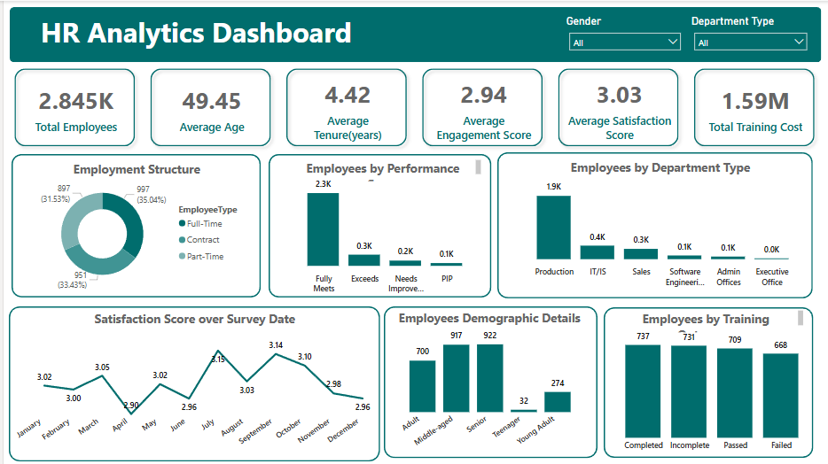

# HR-Data-Analytics-Dashboard-in-PowerBI

## Project Overview

This Power BI dashboard was created as a part of my first mini project during the BI Bootcamp conducted at AI Datayard under the guidance of Ma'am Rabbiyah. The main objective was to analyze employee-related data, explore data visualization features in Power BI, and derive key insights in a clean and interactive way.

During this project, I encountered the challenge of managing multiple similar charts which made the dashboard look crowded. To solve this, I learned about a useful Power BI feature called **Hierarchies**, which allowed me to group fields like `Business Unit`, `Department`, and `Division` into a single drillable visual. This helped in organizing related data together and avoiding repetition across visuals.

##  Dashboard Preview

## Key Learnings

### 1. Hierarchies in Power BI

I learned how to create hierarchies by dragging related fields into one another in the Fields pane. This enabled drill-down functionality in charts, making it possible to explore multiple levels of data (e.g., from Business Unit down to Division) within the same visual.

### 2. Drill-Down Visuals

Using hierarchies, I was able to create visuals that allow the user to click and explore deeper levels of the data. This reduced the number of individual charts on the dashboard and made the analysis more interactive.

### 3. Calculated Columns with DAX

To analyze Age Groups, I created a calculated column using DAX that categorized employees as "Teenagers," "Young Adults," or "Adults" based on their age. This helped in understanding engagement and satisfaction across age groups.

### 4. Clean Data Design

I applied slicers and filters, used consistent formatting, and ensured that charts communicated insights effectively. The visual style followed a structured color palette to maintain visual harmony.

## Dashboard Highlights

* **Age Group Distribution**: Categorized employees into meaningful groups using a DAX formula for better demographic insights.
* **Satisfaction Score Over Time**: A line chart showing how employee satisfaction changed based on the survey dates.
* **Training Program Analysis**: Explored training duration, outcomes, and costs using charts.
* **Drill-Down on Business Structure**: Created a hierarchy of Business Unit → Department → Division and used it in a single visual for better exploration.
* **Engagement, Work-Life Balance, and Rating Metrics**: Added cards and bar charts to display average scores and current employee ratings.

## Tools Used

* **Power BI Desktop** – for creating visuals and building the dashboard.
* **DAX** – for writing calculated columns like age groups and tenure.
* **Microsoft Excel** – for cleaning and storing the employee dataset.

## Acknowledgments

Special thanks to **AI Datayard** and **Ma'am Rabbiyah** for organizing the BI Bootcamp and providing clear explanations and support throughout the learning process. This project helped build my confidence in using Power BI for data analysis.

##  Author

**Maira Nawaz**

[LinkedIn](https://www.linkedin.com/in/mairanawaz/) | [Kaggle](https://www.kaggle.com/mairanawaz) | [Github](https://github.com/Maira-Nawaz)

